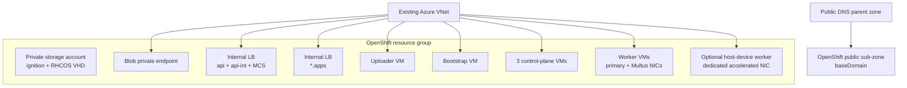
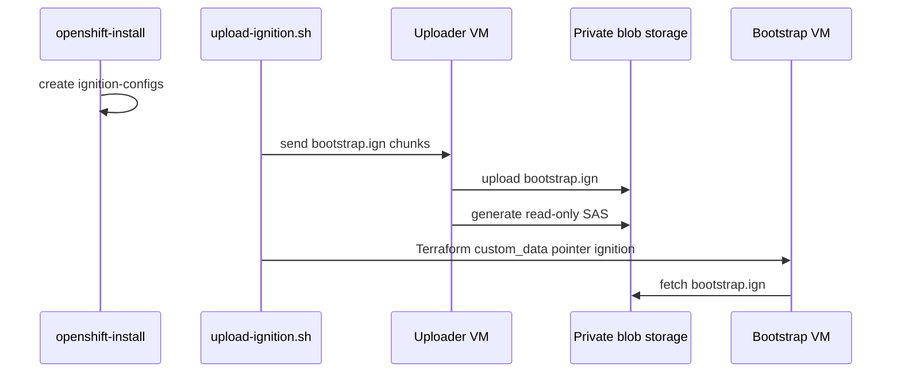

# Architecture

This repository deploys an OpenShift UPI cluster into an existing Azure VNet. Terraform owns the Azure infrastructure; `openshift-install` owns the OpenShift manifests and ignition payloads.

## Azure topology

## Terraform stages

| Stage | Purpose |
|---|---|
| `00-prereqs` | DNS sub-zone, workload resource group, private DNS zone, storage account, containers. |
| `01-network` | Subnets, NSGs, route table, internal load balancers, private endpoint, uploader VM. |
| `02-image` | RHCOS VHD import and Shared Image Gallery image version. |
| `03-bootstrap` | Bootstrap VM using pointer ignition. |
| `04-control-plane` | Control-plane VMs from generated master ignition. |
| `05-workers` | Worker VMs from generated worker ignition, plus optional host-device validation worker. |

## Ignition flow

The generated bootstrap ignition can exceed Azure VM custom data limits. The helper script uploads `install/bootstrap.ign` to the private storage account through the uploader VM, generates a short-lived user-delegation SAS, and writes a small pointer ignition consumed by the bootstrap VM.

## Multus validation

The standard workers receive a secondary NIC on the Multus subnet. The macvlan demo creates a `net1` interface inside pods by using the worker's secondary NIC as the parent interface.

The optional host-device demo gives one worker a dedicated accelerated NIC. Multus host-device CNI moves that entire NIC into one pod's network namespace. While the pod is running, the host no longer owns that NIC.

Always verify actual NIC names and Azure-assigned IPs before applying the demo manifests.
