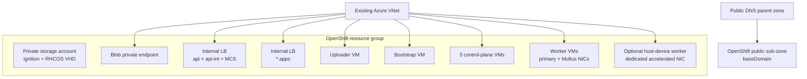
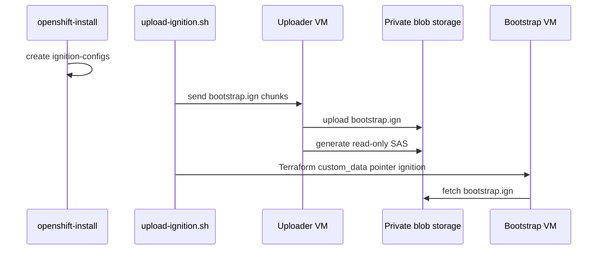
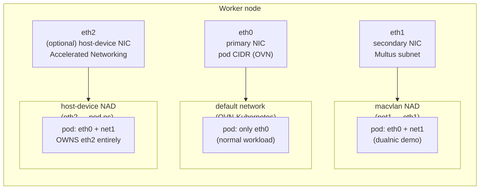
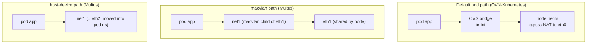

# Architecture

This repository deploys an OpenShift UPI cluster into an existing Azure VNet. Terraform owns the Azure infrastructure; `openshift-install` owns the OpenShift manifests and ignition payloads.

> For **CPU architecture** (x86_64 default vs arm64), VM-size defaults, and how the `ARCHITECTURE` setting flows into the stack, see [`cpu-architecture.md`](./cpu-architecture.md).

## Azure topology

## Subnet layout and node counts

[`network-prereqs.md` section 2](./network-prereqs.md#2-subnet-sizing) is the source of truth for subnet names, sizing guidance, and CIDR planning. The values below are illustrative examples only; do not copy them without confirming your assigned address space.

| Subnet name | Example CIDR only | Purpose |
|---|---|---|
| `snet-ocp-master` | `10.20.0.0/27` | Control-plane primary NICs and the internal API/MCS load balancer. |
| `snet-ocp-worker` | `10.20.1.0/24` | Worker primary NICs and the internal `*.apps` ingress load balancer. |
| `snet-ocp-bootstrap` | `10.20.2.0/28` | Transient bootstrap VM, uploader VM, and the optional Windows browser/RDP jump host when `CREATE_WINDOWS_JUMP=true`. |
| `snet-ocp-multus` | `10.20.3.0/24` | Secondary NICs used by Multus macvlan validation pods. |
| `snet-ocp-sriov` | `10.20.4.0/27` | Optional dedicated accelerated NICs for host-device / SR-IOV-style validation. |

The OpenShift control plane is fixed at **3 control-plane nodes**. The worker pool starts at **2 workers** and can scale to **N workers** as workload needs grow. When `enable_sriov_worker=true`, Terraform can add one optional host-device / SR-IOV-style worker with a dedicated accelerated NIC; see the [data-path contrast](#data-path-contrast-default-cni-vs-macvlan-vs-host-device) for how pods use that NIC.

## Terraform stages

| Stage | Purpose |
|---|---|
| `00-prereqs` | DNS sub-zone, workload resource group, private DNS zone, storage account, containers. |
| `01-network` | Subnets, NSGs, route table, internal load balancers, private endpoint, uploader VM. |
| `02-image` | RHCOS VHD import and Shared Image Gallery image version. |
| `03-bootstrap` | Bootstrap VM using pointer ignition. |
| `04-control-plane` | Control-plane VMs from generated master ignition. |
| `05-workers` | Worker VMs from generated worker ignition, plus optional host-device validation worker. |

## Ignition flow

The generated bootstrap ignition can exceed Azure VM custom data limits. The helper script uploads `install/bootstrap.ign` to the private storage account through the uploader VM, generates a short-lived user-delegation SAS, and writes a small pointer ignition consumed by the bootstrap VM.

## Multus validation

The standard workers receive a secondary NIC on the Multus subnet. The macvlan demo creates a `net1` interface inside pods by using the worker's secondary NIC as the parent interface.

The optional host-device demo gives one worker a dedicated accelerated NIC. Multus host-device CNI moves that entire NIC into one pod's network namespace. While the pod is running, the host no longer owns that NIC.

Always verify actual NIC names and Azure-assigned IPs before applying the demo manifests.

## OpenShift cluster view (pods, NADs, nodes)

This view shows what the cluster looks like *after* the install — how the
default cluster network (OVN-Kubernetes), Multus NetworkAttachmentDefinitions,
and the secondary NIC subnets line up at the pod level.

The `pod-security.kubernetes.io/enforce: privileged` label is required on
the Multus demo namespace so that the macvlan and host-device CNI plugins
can attach to host NICs. See [`manifests/multus/README.md`](../manifests/multus/README.md).

## Data-path contrast: default CNI vs macvlan vs host-device

**Latency / throughput trade-off summary:**

| Concern | Default CNI | macvlan | host-device |
|---|---|---|---|
| Encapsulation | Geneve overlay | none (L2 to NIC) | none (L2 to NIC) |
| NAT | yes (egress) | no | no |
| Pod gets its own NIC IP from VNet | no (pod CIDR) | yes (Multus subnet) | yes (Azure-assigned IP) |
| NIC shared with node | n/a | yes | **no — NIC is moved into pod netns** |
| Pods per node on this path | many | many | **one** |
| Best for | general workloads | secondary-NIC workloads, NFV | latency-/throughput-sensitive single pod (e.g. NFV data plane, ML I/O) |

## Why host-device — not the SR-IOV Operator

This repo deliberately uses **Multus host-device CNI** (not the OpenShift
SR-IOV Operator) for the dedicated-NIC validation pod. The trade-offs:

- **Azure VM SR-IOV is exposed as Accelerated Networking** — there is no
  PCI-passthrough surface that the SR-IOV Operator can carve into VFs from
  inside the guest. The operator's value (VF discovery, NIC partitioning,
  DPDK driver binding) requires bare-metal nodes or VMs with PCI-passthrough.
- **Multus host-device CNI works on any Azure VM** that has a dedicated
  secondary NIC (Accelerated Networking enabled). The CNI plugin runs
  `ip link set` to move the entire NIC into the pod network namespace.
- **One pod owns the NIC** while running — by design. For multi-tenant
  partitioning of a single physical NIC, prefer SR-IOV Operator on
  bare-metal or macvlan for software multiplexing.

When customers ask "should we use SR-IOV Operator on Azure?", the answer
for VM-based deployments is usually no — Accelerated Networking + Multus
host-device gives the same data-path performance with much less
operational complexity. See also the OpenShift documentation on
*Configuring an additional network for VRF and host-device*.
