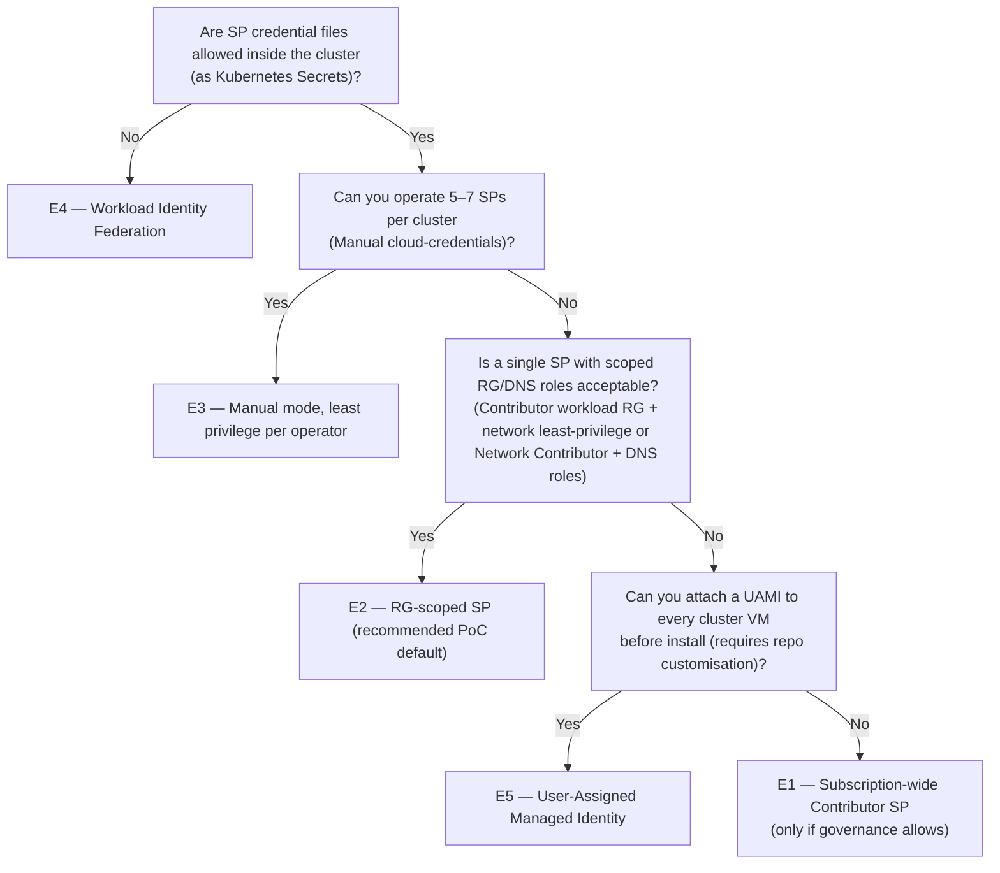

# Azure identity & credentials options for OpenShift UPI

OpenShift on Azure UPI needs Azure credentials at **two distinct stages**,
and tenant governance often constrains which credential model is allowed.
This document covers five concrete options (E1 – E5), with a decision tree
and per-option setup. Pick one before `make prereqs`.

> **Provisioning operator vs install SP:** this page describes the roles
> granted **to the install Service Principal**. The human or automation
> that creates the SP and grants these roles needs separate setup
> permissions in Entra ID and Azure RBAC. See
> [`azure-credentials.md` "Permissions the person setting up the SP
> needs"](./azure-credentials.md#permissions-the-person-setting-up-the-sp-needs).

## Why two stages

| Stage | Used by | Minimum scope |
|---|---|---|
| **Install-time** | `openshift-install create manifests/ignition` validates against ARM (locations, VNet, VM SKUs, HyperVGeneration). | Reader on the subscription is usually enough. |
| **Cluster-runtime** | Cloud-controller-manager, Ingress operator, Cloud-Credential Operator (CCO), Image-Registry operator, Machine API. These create LoadBalancers, public IPs, mutate VMs, write storage accounts, manage NSG rules. | **Contributor-level** rights, scope depends on chosen option (E1 – E5). |

**The "Manual" cloud-credentials mode does not remove the need for
runtime privileges.** It only lets you provide per-operator credentials
yourself instead of having CCO mint them from a single subscription-wide
Service Principal.

## The five options at a glance

| # | Model | Install-cred | Runtime-cred | Setup effort | Security | Typical fit |
|---|---|---|---|---|---|---|
| **E1** | Subscription-scoped Contributor SP | one SP, Reader on sub | same SP, Contributor on whole sub | low | weak — runtime can create resources in any RG | not allowed in most enterprise tenants |
| **E2** | RG-scoped SP | one SP, Reader on sub | same SP, Contributor on workload RG + Network Contributor on VNet RG **or BYO-network least-privilege subnet/route grants** + DNS/private-DNS scoped roles | low / medium | medium — blast radius limited to the required RGs/zones | **recommended PoC default** |
| **E3** | Manual cloud-credential mode (per-operator least privilege) | one install SP (Reader) | one SP **per Azure operator** (CCM, ingress, machine-API, image-registry, CSI), each with its minimal role | high — 5–7 SPs created manually + secrets injected before `create ignition` | strong — least privilege per component | best stable enterprise pattern when you can budget the operations work |
| **E4** | Azure Workload Identity Federation (WIF / OIDC) | one install SP (Reader) | **no long-lived secrets** — cluster service accounts request short-lived tokens from Azure AD via federated identity credentials | high — needs `ccoctl azure` to publish an OIDC issuer (storage account / public blob) and create federated identity credentials | strongest — no secrets on disk, automatic rotation | most modern enterprise pattern; needs OIDC issuer to be reachable from Azure AD |
| **E5** | User-Assigned Managed Identity attached to VMs | one install SP (Reader) | cluster VMs get a UAMI; runtime uses the VM's MSI for Azure API calls | medium — requires Terraform changes to create UAMI and attach it to every master / worker | strong — no secrets on disk | familiar Azure pattern, but **not UPI-default** — this repo would need a fork-level change |

## Decision tree



## E2 — RG-scoped SP (recommended PoC default)

This is the path the repo's default tfvars and lifecycle scripts assume.
It is usually the right PoC model, but it still needs coordination with
the subscription owner, DNS owner, and network/private-DNS owner.

```bash
# 1. Create the SP (no role yet)
SP_NAME="ocp-installer"
APP_ID=$(az ad sp create-for-rbac --name "$SP_NAME" --years 1 --skip-assignment \
  --query appId -o tsv)

# 2. Install-time ARM validation
az role assignment create --assignee "$APP_ID" \
  --role "Reader" \
  --scope "/subscriptions/$SUBSCRIPTION_ID"

# 3. Assign Contributor on the workload RG
#    (Terraform workload resources + cluster runtime: LB / PIP / VM mutations)
az role assignment create --assignee "$APP_ID" \
  --role "Contributor" \
  --scope "/subscriptions/$SUBSCRIPTION_ID/resourceGroups/$WORKLOAD_RG"

# 4. Assign network access.
#    Repo-managed/default path: Network Contributor on the VNet RG.
az role assignment create --assignee "$APP_ID" \
  --role "Network Contributor" \
  --scope "/subscriptions/$SUBSCRIPTION_ID/resourceGroups/$NETWORK_RG"

#    BYO-network least-privilege alternative: if the network team
#    pre-creates subnets, NSGs, and UDR associations, do not grant VNet
#    Contributor. Instead grant:
#      - subnet read + join/action on the five OCP subnets
#      - route read/write/delete on the cluster route table
#    See docs/network-prereqs.md#4a-least-privilege-azure-rbac-for-byo-network-mode.

# 5. Public DNS parent-zone delegation
az role assignment create --assignee "$APP_ID" \
  --role "DNS Zone Contributor" \
  --scope "$PARENT_DNS_ZONE_ID"

# 6. Storage Private Endpoint DNS writes, if privatelink.blob.core.windows.net
#    is owned by a hub/connectivity/private-DNS RG.
az role assignment create --assignee "$APP_ID" \
  --role "Private DNS Zone Contributor" \
  --scope "$PRIVATE_DNS_ZONE_OR_RG_ID"

# 7. Save credentials in the file openshift-install reads
mkdir -p ~/.azure
cat > ~/.azure/osServicePrincipal.json <<EOF
{
  "subscriptionId": "$SUBSCRIPTION_ID",
  "clientId":       "$APP_ID",
  "clientSecret":   "<from-create-for-rbac-output>",
  "tenantId":       "$TENANT_ID"
}
EOF
chmod 600 ~/.azure/osServicePrincipal.json
```

If the repo creates the workload resource group, the identity running
`make prereqs` must be able to create resource groups in the cluster
subscription. Many enterprises instead pre-create `$WORKLOAD_RG` and
grant the install SP Contributor on that RG before the installer runs.
Also note that this repo creates a `Storage Blob Data Owner` assignment
on the installer storage account so uploads work when shared-key access
is disabled; the identity running `make prereqs` therefore needs
role-assignment permission at the workload RG/storage scope, or that
data-plane assignment must be provisioned by an RBAC administrator.

See [`docs/azure-credentials.md`](./azure-credentials.md) for the
credential-file format details, provisioning-operator permissions,
`chmod` requirements, and cleanup.

## E3 — Manual cloud-credential mode

Generate manifests, then provide per-operator credentials before ignition:

```bash
./openshift-install --dir=install create manifests

# Set CCO to Manual
yq -i '.spec.credentialsMode = "Manual"' install/cluster-config.yaml

# Create a SP per Azure operator (illustrative — see Red Hat docs for exact list)
for op in ccm ingress machine-api image-registry csi; do
  APP_ID=$(az ad sp create-for-rbac --name "ocp-$op" --years 1 --skip-assignment \
    --query appId -o tsv)
  # assign the minimal role per operator (see Red Hat "Azure: required permissions")
  # write the secret manifest into install/openshift-cluster-credential-$op-secret.yaml
done

./openshift-install --dir=install create ignition-configs
```

## E4 — Workload Identity Federation (WIF)

The Red Hat `ccoctl azure` flow creates Azure AD applications, federated
identity credentials, and an OIDC issuer (cluster-managed via a storage
account public blob, or your own). After install, cluster service
accounts exchange OIDC tokens for short-lived Azure tokens — no
long-lived secrets are stored.

```bash
# Outline (see Red Hat docs for the complete step-by-step)
ccoctl azure create-all \
  --name "$CLUSTER_NAME" \
  --region "$REGION" \
  --subscription-id "$SUBSCRIPTION_ID" \
  --tenant-id "$TENANT_ID" \
  --credentials-requests-dir "$CREDENTIALS_REQUESTS_DIR" \
  --output-dir "$WIF_OUTPUT_DIR"
```

Verify the OIDC issuer URL is reachable from Azure AD (some tenants
block public blob storage). If blocked, host the issuer behind an
allowed endpoint or fall back to E3.

## E5 — User-Assigned Managed Identity

Out of the box this repo does not attach a UAMI. The customisation is
small but real:

1. Add an `azurerm_user_assigned_identity` resource (cluster scope).
2. Set `identity { type = "UserAssigned"; identity_ids = [...] }` on
   every master + worker `azurerm_linux_virtual_machine`.
3. Set CCO to Manual mode and inject per-operator secrets that reference
   the UAMI's client-id.

Familiar Azure pattern but **not the canonical UPI flow** — best fit
where customers already standardise on UAMIs and have tooling to manage
them.

## Cleanup

Per-option cleanup commands:

```bash
# E1 / E2
az ad sp delete --id "$APP_ID"
rm -f ~/.azure/osServicePrincipal.json

# E3
for op in ccm ingress machine-api image-registry csi; do
  APP_ID=$(az ad sp list --display-name "ocp-$op" --query '[0].appId' -o tsv)
  az ad sp delete --id "$APP_ID"
done

# E4
ccoctl azure delete \
  --name "$CLUSTER_NAME" \
  --region "$REGION" \
  --subscription-id "$SUBSCRIPTION_ID" \
  --delete-oidc-resource-group

# E5
# az ad sp delete the install SP, then delete the UAMI resource via Terraform
```

## Related operator-level docs

- **`docs/azure-credentials.md`** — provisioning-operator permissions,
  install-time SP file format, and `chmod`
- **`docs/image-registry-options.md`** — how the chosen identity model
  interacts with image-registry storage-account auth
  (`allowSharedKeyAccess=false` tenants force E2/E3/E5 to use AAD on
  the storage account)
- **`docs/preflight-checklist.md`** — `make preflight` validates the
  chosen SP has the right roles on the right scopes before install

## Background

OpenShift's Cloud-Credential Operator (CCO) modes are documented in the
upstream Red Hat docs *Configuring the Cloud Credential Operator
utility*. This page focuses on the **Azure UPI** subset and adds the
RG-scoped pattern (E2) used by this repo's tfvars defaults.
